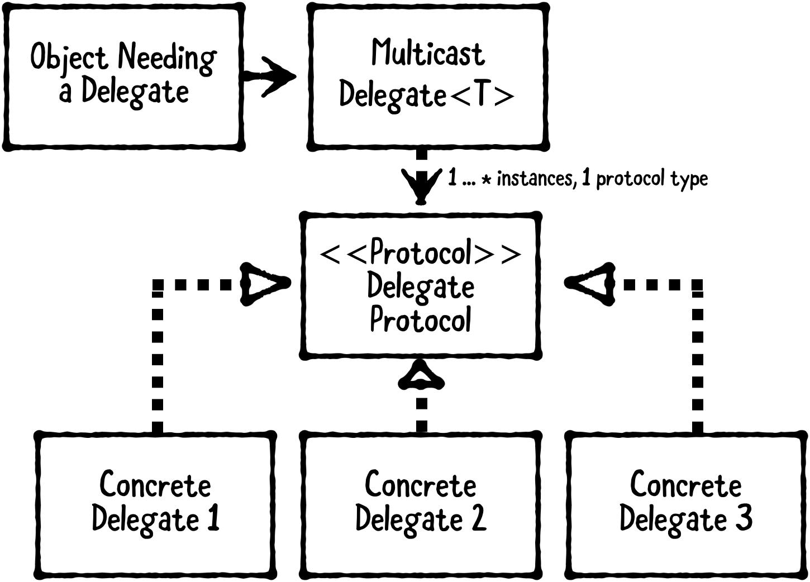

# DelegateNotificationCenter

<p align="center"> <br>

 


Super simple solution to replace NotificationCenter using Multicast Delegate pattern

✅ Type Safe 

✅ Thread Safe

✅ Memory Safety

💯 Fully Tested

Benefits of DelegateNotificationCenter over NotificationCenter:
    
* Obvious control flow. You no longer need to use text search to find all recipients. You can easily find recipients using "jump to definition"
* Ability to get a non-void result from calling the delegate
* Type safety. You no longer need to use downcasting. Now you can pass the type directly
* Testability

## Usage

#### General

#### One-to-one relationship
 
1. Implement delegate protocol
```
protocol FirstViewControllerNotificationDelegate: AnyObject {
    func buttonDidTap()
}
```

2. Declare a notification group name and initialize the MulticastDelegate with the delegate protocol
```
class MyAppNotificationCenter {
    static var firstViewController = MulticastDelegate<FirstViewControllerNotificationDelegate>()
}
```

4. Assign the delegate
```
class SecondViewController: UIViewController {
    override init(nibName nibNameOrNil: String?, bundle nibBundleOrNil: Bundle?) {
        super.init(nibName: nibNameOrNil, bundle: nibBundleOrNil)
        MyAppNotificationCenter.firstViewController.delegate(self)
    }
}
```

5. Conform to the delegate protocol
```
extension SecondViewController: FirstViewControllerNotificationDelegate {
    func buttonDidTap() {
        // do something
    }
}
```

6. Call a delegate method
```
class FirstViewController: UIViewController {
    @objc func buttonDidTap() {
        MyAppNotificationCenter.firstViewController.call {
            $0.buttonDidTap()
        }
    }
}
```
 
 #### One-to-many relationship
 
1. Implement delegate protocol
```
protocol TabBarNotificationDelegate: AnyObject {
    func tabBarDidSelect(with tag: Int)
}
```

2. Declare a notification group name and initialize the MulticastDelegate with the delegate protocol
```
class MyAppNotificationCenter {
    static var tabBar = MulticastDelegate<TabBarNotificationDelegate>()
}
```

4. Assign the delegate
```
class FirstViewController: UIViewController {
    override init(nibName nibNameOrNil: String?, bundle nibBundleOrNil: Bundle?) {
        super.init(nibName: nibNameOrNil, bundle: nibBundleOrNil)
        MyAppNotificationCenter.tabBar.delegate(self)
    }
}
 
class SecondViewController: UIViewController {
    override init(nibName nibNameOrNil: String?, bundle nibBundleOrNil: Bundle?) {
        super.init(nibName: nibNameOrNil, bundle: nibBundleOrNil)
        MyAppNotificationCenter.tabBar.delegate(self)
    }
}

class ThirdViewController: UIViewController {
    override init(nibName nibNameOrNil: String?, bundle nibBundleOrNil: Bundle?) {
        super.init(nibName: nibNameOrNil, bundle: nibBundleOrNil)
        MyAppNotificationCenter.tabBar.delegate(self)
    }
}

```

5. Conform to the delegate protocol
```
extension FirstViewController: TabBarNotificationDelegate {
    func tabBarDidSelect(with tag: Int) {
        print(type(of: self), #function, tag)
    }
}

extension SecondViewController: TabBarNotificationDelegate {
    func tabBarDidSelect(with tag: Int) {
        print(type(of: self), #function, tag)
    }
}
 
extension ThirdViewController: TabBarNotificationDelegate {
    func tabBarDidSelect(with tag: Int) {
        print(type(of: self), #function, tag)
    }
}
```

6. Call a delegate method
```
class TabBarController: UITabBarController {  
    override func tabBar(_ tabBar: UITabBar, didSelect item: UITabBarItem) {
        MyAppNotificationCenter.tabBar.call {
            $0.tabBarDidSelect(with: item.tag)
        }
    }
}

```

#### Additional

If you no longer need a delegate, then remove it

```
MyAppNotificationCenter.firstViewController.remove(self)
```

It is not necessary to implement all delegate functions
```
// Empty default implementation
extension FirstViewControllerDelegate {
    func buttonDidTap() {}
    func doSomething(with text: String) {}
}
```

## Installation
    
#### Manually

Just copy MulticastDelegate.swift to your project 

```
public class MulticastDelegate<T> {
    private let delegates: NSHashTable<AnyObject> = NSHashTable.weakObjects()
    
    public var delegatesCount: Int {
        delegates.allObjects.count
    }
    
    public func remove(_ delegateToRemove: T) {
        for delegate in delegates.allObjects.reversed() where delegate === delegateToRemove as AnyObject {
            delegates.remove(delegate)
        }
    }
    
    public func call(_ block: (T) -> Void) {
        for delegate in delegates.allObjects.reversed() {
            block(delegate as! T)
        }
    }
    
    public func delegateCount() -> Int {
        return delegates.allObjects.count
    }
}
```

#### Swift Package Manager

```swift
.package(name: "DelegateNotificationCenter", url: "https://github.com/NikitaKosolapov/DelegateNotificationCenter.git", from: "1.0.0")
```
 
#### Cocoa pods

## License

DelegateNotificationCenter is under the MIT license.

## Resources
https://www.vadimbulavin.com/multicast-delegate/
 
https://nalexn.github.io/callbacks-part-1-delegation-notificationcenter-kvo/
 
https://assets.alexandria.raywenderlich.com/books/des/images/c57492352703ffd13faa67205936b3bcb113947305da80d0be80770d0ceea10e/original.png
